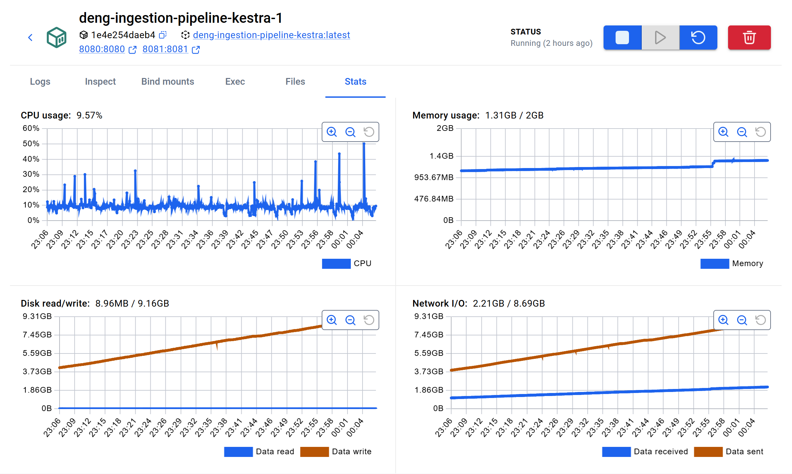
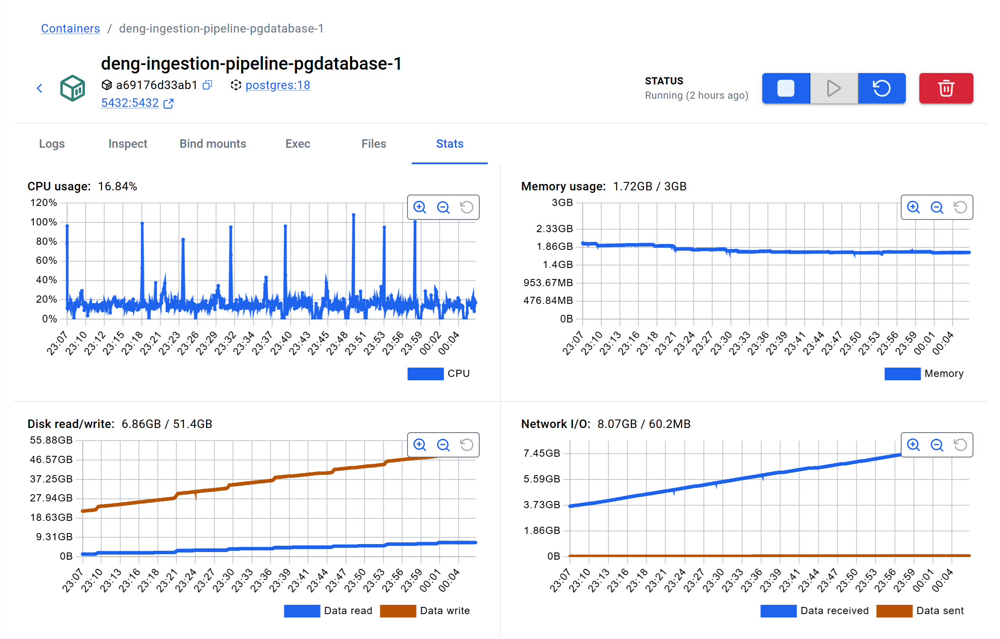

# Known Issues and Design Decisions

## Known Issues

### 1. Incomplete lookup coverage

Some codes found in raw GDELT event data were missing from the downloaded lookup files.

Examples:
- actor country codes present in source events but missing from the CAMEO country lookup
- geographic country codes present in event geography fields but missing from the FIPS country lookup

This means lookup tables cannot be treated as fully complete or authoritative.

#### Consequence

Some foreign key constraints that initially looked desirable in the silver layer had to be relaxed again because they made the transformation pipeline too fragile.

The pipeline therefore prefers robust ingestion and preservation of raw source codes over strict rejection of partially enriched records.

### 2. Ambiguous lookup mappings

The known-group lookup contained at least one ambiguous mapping:

- `CEM` was associated with conflicting meanings

Instead of silently picking one interpretation, the project uses an explicit curated resolution:

- `known_group_name = 'AMBIGUOUS: CEMAC / COMESA'`
- `is_ambiguous = TRUE`

#### Consequence

The ambiguity stays visible in the data model instead of being hidden. That is more honest and more useful for later analysis.

### 3. Score bias toward high-volume countries

The initial version of the gold-layer instability score was based on weighted category counts:

- conflict-related events
- protest-related events
- diplomatic-tension-related events

This worked technically, but large countries with consistently high event volume tended to dominate the score.

#### Consequence

The current score is usable as a first monitoring signal, but it still favors absolute event volume. A later version should introduce normalization or damping so that unusual activity stands out more clearly.

### 4. Parent-to-subflow input passing in Kestra was unreliable in the local setup

Passing inputs from a parent flow to a subflow was unreliable in the local Kestra setup.

The affected case was the parameterized `manifest_sync` subflow, which expected:

- `years`
- `months`
- `days`

When the subflow was started directly, the inputs worked. When triggered from the parent flow, Kestra sometimes treated the inputs as undeclared and fell back to default values.

#### Consequence

This created a mismatch between the intended orchestration logic and the actual runtime behavior:

- manual backfill parameters were not always propagated correctly
- the subflow could fall back to incremental behavior even when a backfill window had been provided
- the execution path became harder to reason about and validate

#### Current handling

For the current project stage, this is treated as a tooling limitation of the local Kestra setup rather than a pipeline logic bug.

As a workaround, the manifest step is executed directly in the parent flow instead of being called as a parameterized subflow. This keeps the runtime behavior predictable.

### 5. Malformed numeric values in source export files

Not all GDELT export files are perfectly clean from a strict database-loading perspective.

In one observed case, a source file contained a malformed numeric value such as:

- `42#.5`

This caused PostgreSQL to reject the row when numeric columns were loaded too strictly during bronze ingestion.

#### Consequence

A single malformed numeric value could otherwise cause the ingestion of an entire batch to fail.

#### Current handling

The bronze ingestion process was made more defensive:

- the temporary import table loads source fields as text first
- numeric values are validated and cast in a second step
- invalid numeric values are coerced to `NULL` instead of aborting the whole batch
- affected columns and sample values are logged as warnings during ingestion

This keeps the pipeline running while still making the data quality issue visible.

### 6. Large historical backfills are stable but slow in the current local setup

| Kestra | PostgreSQL |
|---|---|
|  |  |

A large backfill over several months is possible in the current implementation, but it takes a long time in the local Docker-based setup.

The main reason is not a single failing query, but the overall workload:
- many small GDELT export batches
- serial download, extraction, and bronze loading
- sustained database writes during long runs

In an observed long backfill run, the containers remained stable over time without crashing or running into extreme memory pressure. The main limitation was throughput, not correctness or reproducibility.

#### Current handling

For review and local validation, smaller windows such as incremental runs or `days = 2` are recommended.

#### Planned improvement

A practical next step is to add a batch limit or chunked execution mode for large backfills.

## Key Design Decisions

### 1. Bronze stays source-aligned

The bronze layer intentionally remains close to the raw GDELT event structure.

#### Why

This keeps ingestion simpler and makes the raw data easier to validate, debug, and trace back to the source.

#### Trade-off

The bronze layer is not convenient for direct analysis. That is acceptable because its job is storage, lineage, and reproducibility.

### 2. Silver is the drill-down layer

The silver layer is not just a cleaned copy of bronze. It is the event-level layer analysts inspect when a signal in gold needs explanation.

#### Why

This layer standardizes timestamps, keeps source links, applies lookup enrichment, and adds the project-specific risk flags needed for event-level investigation.

#### Trade-off

That introduces project-specific logic into the model, but it makes the layer much more useful for the defined analyst workflow.

### 3. Gold is use-case-driven

The gold layer compresses event-level complexity into hourly country-level summaries.

#### Why

The analyst needs prioritization, monitoring, and a quick overview before drilling down into individual events.

#### Trade-off

Gold does not preserve all source detail. That detail remains in silver by design.

### 4. Hard foreign keys are used selectively

The project originally aimed for stricter foreign key enforcement in the silver layer.

#### Why this changed

In practice, lookup incompleteness caused otherwise valid source events to fail during transformation.

#### Final decision

Hard foreign keys are kept where they are stable and central to the model, but relaxed for enrichment fields where real-world lookup coverage is incomplete.

#### Trade-off

This reduces relational strictness, but makes the transformation pipeline more robust.

### 5. Curated risk categories are a project abstraction

The categories

- protest
- conflict
- diplomatic tension

are not native top-level outputs of the source data. They are a project-specific abstraction built on top of the CAMEO event hierarchy.

#### Why

The analyst does not want to monitor hundreds of raw event codes directly. A smaller set of interpretable monitoring dimensions is more useful.

#### Trade-off

This requires a curated mapping layer and explicit project logic, but produces outputs that are easier to work with.

### 6. Gold currently uses full refresh

The current gold build process rebuilds the aggregation table from silver instead of incrementally updating changed windows only.

#### Why

For the current project stage, full refresh is simpler, easier to verify, and easier to explain.

#### Trade-off

It is less efficient than a true incremental aggregation strategy, but much easier to reason about during development and demonstration.

## Development and Environment Lessons

### 1. Containerized virtual environments needed isolation

When the project directory was mounted into the Docker pipeline container, the container initially created a `.venv` owned by `root` in the host repository.

#### Consequence

This caused permission problems for local development outside Docker.

#### Solution

The container-side virtual environment was isolated from the host project by masking `/app/.venv`. This prevents the container runtime from overwriting the host-side local virtual environment.

### 2. `Path.cwd()` was too fragile as a project anchor

Using `Path.cwd()` for important internal paths turned out to be fragile when:

- users started the CLI from different directories
- multiple entry points existed
- orchestration tools called the pipeline from varying contexts

#### Solution

The project moved toward an explicit `PROJECT_ROOT` anchor to make path handling more predictable across environments.

## Planned Improvements

The next likely improvements are:

- refine the instability score to reduce bias toward high-volume countries
- improve retry and failure-handling behavior in orchestration
- extend the current local setup toward the cloud-oriented final project stage
- evaluate whether selected gold-layer logic should later become incremental
